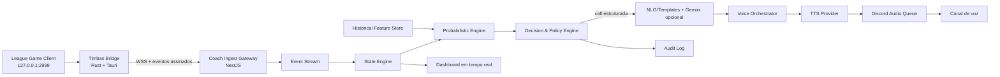

# Timbas Coach — Plano Técnico Futuro

> Status: proposta para pesquisa e desenvolvimento futuro. Não representa uma funcionalidade pronta.
>
> Objetivo: criar um coach de macro probabilístico para League of Legends que combine histórico, estado público da partida e eventos observáveis para oferecer alertas curtos por voz no Discord, sem afirmar posições ocultas como fatos e sem usar um LLM como fonte de verdade.

## 1. Visão do produto

O Timbas Coach deve acompanhar uma sessão de jogo por meio de um bridge local instalado no computador de um participante. Esse bridge lê somente as interfaces locais autorizadas/disponíveis do cliente, normaliza os dados e envia eventos para a API do Timbas.

A API mantém um estado temporal da partida, combina esse estado com perfis históricos e calcula probabilidades de acontecimentos macro. Um motor de decisão converte apenas sinais relevantes e suficientemente confiáveis em opções curtas. O Gemini pode reescrever essas opções em linguagem natural, mas não pode criar fatos, probabilidades ou recomendações fora do resultado estruturado do motor.

Exemplo desejado:

> "O jungler costuma sair do topo para mid nesta janela. Mid pode jogar com cobertura ou ceder pressão até ele aparecer."

Exemplo proibido pelo desenho do sistema:

> "O jungler está no arbusto do bot. Ataquem agora."

## 2. Princípios

1. **Probabilidade, não onisciência:** toda inferência deve declarar confiança e origem dos sinais.
2. **LLM fora do caminho crítico:** modelos generativos escrevem a frase; modelos determinísticos ou estatísticos calculam o estado.
3. **Opções, não ordens:** apresentar duas escolhas viáveis quando a decisão depender do jogador.
4. **Dados mínimos:** coletar apenas o necessário para a sessão e aplicar retenção curta por padrão.
5. **Explicabilidade:** cada call precisa ser reconstruível a partir dos sinais usados.
6. **Degradação segura:** sem dados ou com baixa confiança, o bot fica em silêncio.
7. **Baixa interferência:** poucas calls, curtas, priorizadas e com cooldown.
8. **Conformidade por design:** modos e tipos de call devem ser liberados por política, não apenas por capacidade técnica.

## 3. Escopo

### 3.1 Incluído

- Detecção local de início, andamento e fim da partida.
- Leitura de tempo, jogadores, campeões, itens, níveis, placar, mortes, respawns e eventos disponíveis.
- Enriquecimento com histórico pré-jogo do Clash Scout e Match-v5 Timeline.
- Estado probabilístico por região ampla: top, rio superior, mid, rio inferior, bot, jungle aliada e jungle inimiga.
- Previsão de janelas de pressão, gank e objetivo com nível de confiança.
- Calls de macro com alternativas, justificativa e validade temporal.
- Sessão vinculada a servidor, canal de voz e partida do Discord.
- TTS, fila de áudio, prioridade, cooldown e cancelamento de mensagens obsoletas.
- Replay offline para testar o motor sem abrir o League.
- Dashboard para sessão, saúde da conexão e auditoria das calls.

### 3.2 Fora do escopo

- Revelar posição real de inimigos fora da visão.
- Ler memória do processo, injetar DLL, automatizar comandos ou controlar mouse/teclado.
- Capturar pacotes privados do cliente.
- Rastrear automaticamente cooldowns inimigos não apresentados ao jogador.
- Dar calls de micro como alvo de skill, combo, dodge ou instante exato de engage.
- Tratar uma inferência como observação confirmada.
- Usar captura do minimapa em produção sem revisão técnica, jurídica e de política específica.

## 4. Modos de operação

| Modo | Destinatário | Dados | Calls | Risco |
|---|---|---|---|---|
| Pré-jogo | Jogadores | Histórico agregado | Tendências, riscos e plano | Baixo |
| Assistente seguro | Jogadores | Estado público + histórico | Alertas neutros e opções | Médio; exige validação de política |
| Narrador de custom | Participantes/espectadores | Eventos da custom | Narração e contexto | Médio |
| Espectador com atraso | Audiência | Feed de espectador atrasado | Análise ampla | Menor risco competitivo |
| Pós-jogo | Jogadores | Timeline completa | Coaching detalhado | Baixo |

O modo padrão deve ser **Pré-jogo + Pós-jogo**. O modo em tempo real deve depender de feature flag por servidor e de uma matriz explícita de calls permitidas.

## 5. Arquitetura proposta



### 5.1 Bridge local

Tecnologia recomendada: **Rust + Tokio + Tauri 2**.

Motivos:

- Binário pequeno e baixo consumo durante a partida.
- Concorrência e rede seguras sem runtime pesado.
- Aplicativo de bandeja simples para pareamento, status e atualização.
- Distribuição assinada e auto-update controlado.

Responsabilidades:

- Detectar disponibilidade de `127.0.0.1:2999`.
- Consultar endpoints mínimos em intervalos adaptativos.
- Converter snapshots em eventos incrementais.
- Remover duplicatas e limitar frequência antes do upload.
- Manter buffer local criptografado durante perda curta de conexão.
- Parear com uma sessão usando código de uso único ou QR code.
- Nunca armazenar chave da Riot ou token permanente em arquivo aberto.
- Exibir claramente quando a coleta está ativa e permitir encerramento imediato.

Intervalos iniciais sugeridos:

- Estado da sessão: 2 segundos durante a partida.
- Eventos: 1 segundo, com deduplicação por identificador.
- Jogadores/itens/placar: 3 a 5 segundos.
- Fora da partida: backoff progressivo até 30 segundos.

### 5.2 Transporte e sessão

- WebSocket seguro (`WSS`) para sessão bidirecional.
- Eventos versionados com JSON Schema no MVP; Protobuf somente se volume justificar.
- `sessionId`, `deviceId`, `sequence`, `capturedAt`, `gameTime` e `schemaVersion` em todo envelope.
- Sequência monotônica por dispositivo para rejeitar replay e reordenar eventos.
- Heartbeat a cada 10 segundos e expiração automática da sessão.
- Idempotência por `sessionId + deviceId + sequence`.
- Uma fonte primária por sessão no MVP.
- Em versões futuras, múltiplos bridges podem aumentar evidência, nunca duplicar calls.

Exemplo de envelope:

```json
{
  "schemaVersion": 1,
  "sessionId": "coach_01...",
  "deviceId": "device_01...",
  "sequence": 184,
  "capturedAt": "2026-07-19T20:15:32.412Z",
  "gameTime": 412.4,
  "type": "PLAYER_SCORE_CHANGED",
  "payload": {
    "riotId": "Player#BR1",
    "kills": 2,
    "deaths": 1,
    "assists": 3
  }
}
```

### 5.3 Backend orientado a eventos

Novos módulos sugeridos na API:

```text
src/coach/
├── coach.module.ts
├── sessions/
├── ingest/
├── state/
├── prediction/
├── decision/
├── voice/
├── replay/
├── policy/
└── observability/
```

Componentes:

- **CoachSessionService:** ciclo de vida, pareamento, guild, canal, modo e permissões.
- **CoachIngestGateway:** autenticação do bridge, validação e idempotência.
- **GameStateReducer:** reduz eventos em um estado imutável/versionado.
- **PredictionEngine:** calcula distribuições probabilísticas e janelas.
- **DecisionEngine:** seleciona sinais que merecem call.
- **CoachPolicyService:** bloqueia categorias não permitidas pelo modo.
- **LanguageService:** templates primeiro, Gemini opcional com JSON estruturado.
- **VoiceOrchestrator:** TTS, prioridade, cooldown e áudio no Discord.
- **ReplayService:** reproduz sessões gravadas em velocidade configurável.

Para o MVP, a stream pode operar em memória com persistência no PostgreSQL. Para escala horizontal, adotar **NATS JetStream** ou **Redis Streams** atrás de uma interface, evitando acoplar o domínio ao broker.

### 5.4 Persistência

PostgreSQL continua como fonte de verdade.

Entidades futuras:

- `CoachDevice`: dispositivo pareado, chave pública, status e última conexão.
- `CoachSession`: guild, canal, modo, patch, início, fim e fonte primária.
- `CoachEventBatch`: lotes compactados de eventos normalizados.
- `CoachStateSnapshot`: checkpoints para replay rápido.
- `CoachPrediction`: distribuição, confiança, features e versão do modelo.
- `CoachCall`: texto, categoria, prioridade, validade, sinais e resultado do TTS.
- `CoachConsent`: consentimento por usuário/servidor e versão dos termos.
- `CoachModelVersion`: artefato, dataset, métricas e data de ativação.

Retenção recomendada:

- Estado efêmero em Redis/memória: duração da partida + 30 minutos.
- Eventos brutos: desligados por padrão; quando habilitados para teste, 7 dias.
- Eventos normalizados e pseudonimizados: 30 dias no beta fechado.
- Métricas agregadas e modelos: retenção longa sem Riot ID quando possível.
- Exclusão manual por sessão e por dispositivo.

## 6. Motor probabilístico

### 6.1 Representação do mapa

O motor não deve simular coordenadas inexistentes. Ele usa regiões discretas:

```text
TOP_LANE
TOP_RIVER
MID_LANE
BOT_RIVER
BOT_LANE
ALLY_JUNGLE_TOP
ALLY_JUNGLE_BOT
ENEMY_JUNGLE_TOP
ENEMY_JUNGLE_BOT
UNKNOWN
```

Para cada jogador relevante, principalmente o jungler, manter uma distribuição:

```json
{
  "subject": "EnemyJungler#BR1",
  "gameTime": 205.0,
  "belief": {
    "TOP_LANE": 0.12,
    "TOP_RIVER": 0.18,
    "MID_LANE": 0.34,
    "BOT_RIVER": 0.21,
    "BOT_LANE": 0.10,
    "UNKNOWN": 0.05
  },
  "confidence": 0.68,
  "evidence": ["historical_path_top_start", "no_recent_event", "mid_gank_window"]
}
```

### 6.2 Estratégia de modelagem

Evolução recomendada:

1. **Baseline heurístico:** regras, priors históricos e transições temporais.
2. **Filtro Bayesiano/HMM:** crença por região e atualização por evidência.
3. **Modelo tabular calibrado:** LightGBM/XGBoost para prever `next_pressure_region` e `objective_interest`.
4. **Modelo sequencial:** Temporal Convolutional Network ou Transformer temporal apenas após dataset amplo e confiável.
5. **Ensemble:** combinação calibrada de histórico individual, campeão, composição e estado atual.

Não começar com deep learning. Um modelo menor, calibrado e explicável deve superar uma arquitetura sofisticada sem dataset suficiente.

### 6.3 Features históricas

- Região inicial por patch, lado e campeão.
- Primeiro evento do jungler e minuto.
- Distribuição de ganks por rota e faixa de tempo.
- Sequência provável após gank top/mid/bot.
- Participação em dragões, Arauto/objetivos equivalentes e Baron.
- Frequência de invade e counter-jungle observável na timeline pós-jogo.
- Reset e pico de item estimados pelo histórico.
- Mudança de comportamento por composição e elo.
- Recência com decay exponencial.

### 6.4 Features da sessão

- Tempo de jogo.
- Eventos recentes e tempo desde a última evidência.
- Placar e participantes de kills.
- Mortes e respawns.
- Níveis e alterações de itens.
- Objetivos concluídos e próximo objetivo público.
- Diferença de força estimada por itens/níveis.
- Estado da própria equipe conhecido pelo bridge.
- Patch e campeão para ajustar tempos e priors.

### 6.5 Calibração e incerteza

- Medir Brier Score e Expected Calibration Error.
- Aplicar isotonic regression ou Platt scaling por versão do modelo.
- Não emitir call abaixo do limiar de confiança configurado.
- A confiança deve cair com o tempo sem nova evidência.
- Probabilidades devem somar 1 e possuir teste de propriedade.
- Registrar `modelVersion`, features e distribuição em toda previsão usada.

## 7. Motor de decisão

Uma previsão não vira call automaticamente. O motor avalia:

- Confiança mínima.
- Impacto esperado.
- Urgência e tempo de validade.
- Novidade desde a última call.
- Capacidade real de ação.
- Conflito com outra call mais importante.
- Cooldown por categoria e por rota.
- Modo de política ativo.
- Quantidade de fala no último minuto.

Categorias iniciais:

- `GANK_WINDOW`
- `OBJECTIVE_PREP`
- `CROSS_MAP_OPTION`
- `POWER_SPIKE`
- `NUMBER_ADVANTAGE`
- `RESET_WINDOW`
- `RISK_UPDATE`
- `POST_EVENT_REASSESSMENT`

Formato interno obrigatório:

```json
{
  "category": "GANK_WINDOW",
  "priority": 70,
  "validUntilGameTime": 245,
  "confidence": 0.72,
  "facts": ["historical_bot_pressure_window"],
  "hypotheses": ["enemy_jungler_bot_side_likely"],
  "options": ["play_with_cover", "cede_lane_pressure"],
  "forbiddenClaims": ["exact_enemy_position"]
}
```

Regras de fala:

- Máximo inicial: 2 calls por minuto.
- Call comum: até 8 segundos.
- Call crítica: até 5 segundos.
- Uma hipótese sempre usa linguagem como “provável”, “pode” ou “há risco”.
- Fatos e hipóteses não podem ser misturados na mesma oração sem marcação.
- Mensagem expirada é descartada antes do TTS.
- Nova informação pode cancelar áudio ainda não iniciado.

## 8. Linguagem natural e Gemini

O Gemini recebe somente a call estruturada, nunca o feed bruto completo.

Pipeline:

1. Decision Engine gera JSON validado.
2. Template local produz uma frase segura imediatamente.
3. Gemini pode melhorar naturalidade com schema rígido e timeout curto.
4. Validador compara a saída com fatos, hipóteses e palavras proibidas.
5. Se falhar, usar template; nunca inventar uma análise.

O Gemini não deve:

- Calcular probabilidades.
- Inferir posição por conta própria.
- Criar fatos ausentes.
- Alterar prioridade ou validade.
- Dar uma ordem não listada em `options`.
- Bloquear o pipeline de voz.

Exemplo de saída permitida:

> "Há risco maior no mid nesta janela. Jogue com cobertura ou ceda pressão até o jungler aparecer."

## 9. Discord Voice e TTS

Tecnologias:

- `@discordjs/voice` integrado ao módulo Discord existente.
- Provider de TTS abstraído por interface.
- Opções de provider: Azure Neural Speech, Google Cloud TTS ou ElevenLabs.
- FFmpeg/Opus conforme requisitos do provider e do Discord.

Voice Orchestrator:

- Entrar apenas após autorização de usuário no canal.
- Verificar permissões `Connect` e `Speak`.
- Fila por guild com prioridade.
- Cache por hash de texto + voz + velocidade.
- Ducking opcional não é possível controlar no cliente dos usuários; manter volume conservador.
- Comando para pausar, silenciar categoria, reduzir frequência e encerrar sessão.
- Desconectar após inatividade ou fim confirmado da partida.

Comandos futuros:

```text
/coach iniciar
/coach conectar <código>
/coach voz <canal>
/coach modo seguro|narrador|pos-jogo
/coach frequência baixa|normal|alta
/coach silenciar ganks|objetivos|itens
/coach status
/coach parar
```

## 10. Dashboard

Nova área sugerida: `/dashboard/coach`.

Telas:

- Pareamento do bridge.
- Sessão atual e fonte conectada.
- Canal de voz e status do bot.
- Relógio e eventos normalizados.
- Mapa probabilístico em regiões, nunca como posição real.
- Calls emitidas, confiança, evidência e expiração.
- Controles de frequência e categorias.
- Replay pós-jogo sincronizado com calls.
- Métricas de qualidade e feedback “útil / errado / atrasado”.

Atualização em tempo real via SSE para o dashboard; WebSocket fica reservado para o bridge e controles bidirecionais.

## 11. Segurança e privacidade

- Bridge com binário assinado e atualização assinada.
- Pareamento por código curto de uso único com expiração de 2 minutos.
- Identidade de dispositivo por par Ed25519; chave privada no Windows Credential Manager.
- TLS obrigatório e certificate pinning avaliado para o bridge.
- Tokens de sessão curtos, revogáveis e limitados a `coach:ingest`.
- Nenhuma chave de API da Riot no bridge.
- Payloads validados e limitados em tamanho/frequência.
- Proteção contra replay, sequência fora de ordem e relógio adulterado.
- Consentimento explícito e visível antes de iniciar captura.
- Identificadores pseudonimizados nos datasets de treino.
- Logs nunca contêm tokens, áudio privado ou payload bruto desnecessário.
- Rate limit por dispositivo, usuário, guild e IP.
- Kill switch remoto por versão do bridge ou categoria de call.

## 12. Conformidade e política

Antes de liberar o modo em tempo real:

1. Registrar o produto e o fluxo no Riot Developer Portal.
2. Preparar mockup e protótipo reproduzível.
3. Documentar todos os endpoints locais utilizados.
4. Apresentar exemplos exatos de calls permitidas e bloqueadas.
5. Solicitar orientação/aprovação para o modo jogador.
6. Manter um modo estritamente pré/pós-jogo se o modo ao vivo não for aprovado.

Matriz mínima de política:

| Tipo de call | Pré-jogo | Jogador ao vivo | Espectador atrasado | Pós-jogo |
|---|---:|---:|---:|---:|
| Tendência histórica | Sim | Somente se aprovado | Sim | Sim |
| Objetivo público | N/A | Avaliar/aprovar | Sim | Sim |
| Opções macro | Sim | Somente se aprovado | Sim | Sim |
| Posição inferida na névoa | Não | Não | Somente com dados legítimos de espectador | Análise posterior |
| Ordem única “faça agora” | Não | Não | N/A | Não |
| Explicação de erro | N/A | Não durante a ação | Sim | Sim |

## 13. Observabilidade

- OpenTelemetry em bridge, gateway, decisão, Gemini, TTS e Discord.
- Correlation ID do evento até o áudio.
- Métricas:
  - latência evento → estado;
  - latência estado → call;
  - latência call → início do áudio;
  - calls por minuto;
  - calls expiradas antes de tocar;
  - falhas do bridge, Gemini, TTS e Discord;
  - confiança média por categoria;
  - feedback útil/incorreto/atrasado;
  - drift por patch e campeão.
- Logs estruturados com Pino/OpenTelemetry.
- Alertas para aumento de erro, atraso, drift e desconexões.

Metas iniciais:

- p95 bridge → decisão abaixo de 1,5 segundo.
- p95 decisão → áudio abaixo de 2 segundos com cache; abaixo de 4 sem cache.
- Menos de 2 calls por minuto por padrão.
- Zero afirmações de posição exata provenientes de hipótese.
- Mais de 80% das calls consideradas úteis no beta fechado.

## 14. Testes

### 14.1 Replay-first

Antes de qualquer teste ao vivo, gravar sessões normalizadas e executar o motor offline.

- Replay em 0,5x, 1x, 5x e velocidade máxima.
- Golden scenarios para gank, objetivo, reset e troca de lado.
- Comparação determinística entre versões do reducer.
- Simulação de eventos atrasados, duplicados, ausentes e fora de ordem.
- Teste de expiração de calls antes do áudio.

### 14.2 Testes do modelo

- Split temporal por patch; nunca randomizar eventos da mesma partida entre treino e teste.
- Precision/recall por região e janela.
- Brier Score e calibração.
- Avaliação por campeão, elo, lado do mapa e tamanho de amostra.
- Backtest sem usar features futuras.
- Shadow mode: calcular previsões sem falar durante partidas reais.

### 14.3 Testes de integração

- Bridge falso → gateway → reducer → decisão → TTS falso → Discord falso.
- Reconexão e retomada de sequência.
- Rotação/revogação de dispositivo.
- Duas sessões simultâneas em guilds diferentes.
- Fim de partida e limpeza de recursos.
- Teste de carga e soak por duração superior a uma partida longa.

## 15. Roadmap

### Fase 0 — Pesquisa e aprovação

- Confirmar endpoints e payloads reais por patch.
- Registrar o produto e descrever o uso no Developer Portal.
- Criar matriz formal de calls permitidas.
- Definir consentimento, retenção e modo padrão.
- Produzir ADRs das decisões técnicas principais.

**Saída:** escopo aprovado para protótipo e política documentada.

### Fase 1 — Bridge e captura local

- Criar repositório `timbas-coach-bridge`.
- Implementar tray, pareamento e detecção de partida.
- Normalizar eventos com schema versionado.
- Criar gravador local e replay CLI.
- Medir CPU, memória, rede e impacto no jogo.

**Saída:** dataset de sessões próprias reproduzível offline.

### Fase 2 — Estado e replay no backend

- Criar `CoachSession`, ingestão e reducer.
- Persistir lotes e snapshots.
- Dashboard técnico de sessão.
- Testes de eventos duplicados e fora de ordem.

**Saída:** uma partida pode ser reconstruída deterministicamente.

### Fase 3 — Motor probabilístico em shadow mode

- Implementar baseline heurístico.
- Criar HMM/filtro Bayesiano por região.
- Construir feature pipeline offline.
- Calibrar confiança e comparar com timelines pós-jogo.
- Rodar sem emitir calls aos jogadores.

**Saída:** métricas confiáveis por categoria e patch.

### Fase 4 — Decision Engine e linguagem

- Definir categorias, prioridade, cooldown e validade.
- Implementar templates seguros.
- Integrar Gemini apenas como NLG estruturado.
- Criar validador de fatos/hipóteses/opções.
- Adicionar auditoria completa.

**Saída:** calls textuais reproduzíveis no replay.

### Fase 5 — Discord Voice

- Adicionar `@discordjs/voice` e provider de TTS.
- Criar fila por guild, cache e cancelamento.
- Implementar comandos `/coach`.
- Medir atraso e inteligibilidade.

**Saída:** replay offline narrado em canal de teste.

### Fase 6 — Beta fechado em partidas custom

- Consentimento de todos os participantes.
- Feature flags por guild e categoria.
- Feedback após cada call.
- Shadow mode paralelo para comparar chamadas emitidas e suprimidas.
- Revisão de segurança e privacidade.

**Saída:** evidência de utilidade sem excesso de calls.

### Fase 7 — Produção controlada

- Liberar apenas modos/categorias aprovados.
- Assinar bridge e ativar auto-update seguro.
- Observabilidade, alertas, runbooks e kill switch.
- Monitorar drift a cada patch.
- Processo de rollback de modelo e regra.

**Saída:** operação estável, auditável e reversível.

## 16. Backlog por épico

### Bridge

- [ ] Spike Rust/Tauri acessando a API local.
- [ ] Descoberta automática de partida.
- [ ] Schema e deduplicação de eventos.
- [ ] Pareamento e credencial segura.
- [ ] Buffer offline e reconexão.
- [ ] Instalador e atualização assinada.

### Backend

- [ ] Módulo `coach` e DTOs versionados.
- [ ] Gateway autenticado e idempotente.
- [ ] State reducer e snapshots.
- [ ] Replay service.
- [ ] Prediction engine e model registry.
- [ ] Decision/policy engine.
- [ ] Auditoria e retenção.

### IA e dados

- [ ] Definição dos labels de pressão/região.
- [ ] Pipeline de features sem leakage.
- [ ] Baseline heurístico.
- [ ] HMM/Bayes calibrado.
- [ ] Backtest por patch.
- [ ] Shadow mode e monitoramento de drift.

### Discord

- [ ] `@discordjs/voice`.
- [ ] Abstração de TTS.
- [ ] Fila, prioridade e expiração.
- [ ] Comandos e permissões.
- [ ] Controles de frequência e silêncio.

### Web

- [ ] Pareamento do dispositivo.
- [ ] Tela de sessão.
- [ ] Mapa probabilístico.
- [ ] Auditoria de calls.
- [ ] Replay e feedback.
- [ ] Consentimento e exclusão.

## 17. Critérios de sucesso do MVP

O MVP é considerado válido somente quando:

- Uma pessoa instala e pareia o bridge sem configurar chave manualmente.
- O bridge detecta e encerra uma sessão automaticamente.
- O replay reconstrói o mesmo estado com resultado determinístico.
- O motor diferencia fato, hipótese e opção em 100% das calls.
- Nenhuma call é emitida com confiança abaixo do limite.
- Calls expiradas nunca chegam ao áudio.
- O bot entra, fala e sai do canal sem intervenção administrativa adicional.
- Uma falha de Gemini não interrompe templates, estado ou voz.
- O sistema funciona com Gemini e TTS indisponíveis usando degradação segura.
- CPU e rede do bridge não causam impacto perceptível na partida.
- Todos os eventos e calls usados são auditáveis por `sessionId`.

## 18. Riscos principais

| Risco | Impacto | Mitigação |
|---|---|---|
| Política não aprovar calls ao vivo | Alto | Manter pré/pós-jogo e espectador como produtos independentes |
| API local mudar sem aviso | Alto | Adapter versionado, feature detection e kill switch |
| Previsão soar como fato | Alto | Linguagem tipada, validação e testes de propriedade |
| Calls demais | Alto | Cooldown, orçamento por minuto e feedback |
| Dataset pequeno ou enviesado | Alto | Baseline explicável, calibração e shadow mode |
| Latência de TTS/Discord | Médio | Templates, cache e cancelamento por validade |
| Bridge comprometido | Alto | Assinatura, identidade por dispositivo e escopo mínimo |
| Drift após patch | Alto | Métricas por patch, rollback e revalidação |
| Uma fonte enviar dados falsos | Médio | Assinatura, sequência, limites e detecção de anomalia |
| Custo de IA/TTS | Médio | Gemini opcional, templates e cache de áudio |

## 19. Decisões que exigem ADR

- ADR-001: Rust/Tauri versus Node/Electron para o bridge.
- ADR-002: WebSocket e formato de eventos.
- ADR-003: PostgreSQL puro versus broker de eventos.
- ADR-004: representação regional do mapa.
- ADR-005: baseline probabilístico e estratégia de calibração.
- ADR-006: providers de TTS e política de fallback.
- ADR-007: retenção e anonimização de sessões.
- ADR-008: matriz de calls por modo de conformidade.
- ADR-009: estratégia de atualização e assinatura do bridge.

## 20. Próximo passo recomendado

Não começar pelo bot falando. O primeiro investimento deve ser um **spike replay-first**:

1. Bridge mínimo captura uma partida própria.
2. Dados são normalizados e salvos localmente.
3. Replay reconstrói o estado segundo a segundo.
4. Baseline produz previsões sem emitir áudio.
5. Timeline pós-jogo mede acertos, atraso e calibração.

Somente depois de provar que as previsões são úteis, calibradas e conformes, integrar Gemini, TTS e Discord Voice. Isso reduz custo, risco e retrabalho, além de produzir um núcleo técnico testável que não depende de serviços externos.

## 21. Referências oficiais

- [Riot Games — League of Legends Developer API, políticas e Live Client Data API](https://developer.riotgames.com/docs/lol)
- [Discord.js Voice — conexão com canal de voz](https://discordjs.dev/docs/packages/voice/main/JoinVoiceChannelOptions%3AInterface)
- [Gemini API — structured outputs](https://ai.google.dev/gemini-api/docs/structured-output)
- [Gemini API — tratamento de erros e retries](https://ai.google.dev/gemini-api/docs/troubleshooting)
